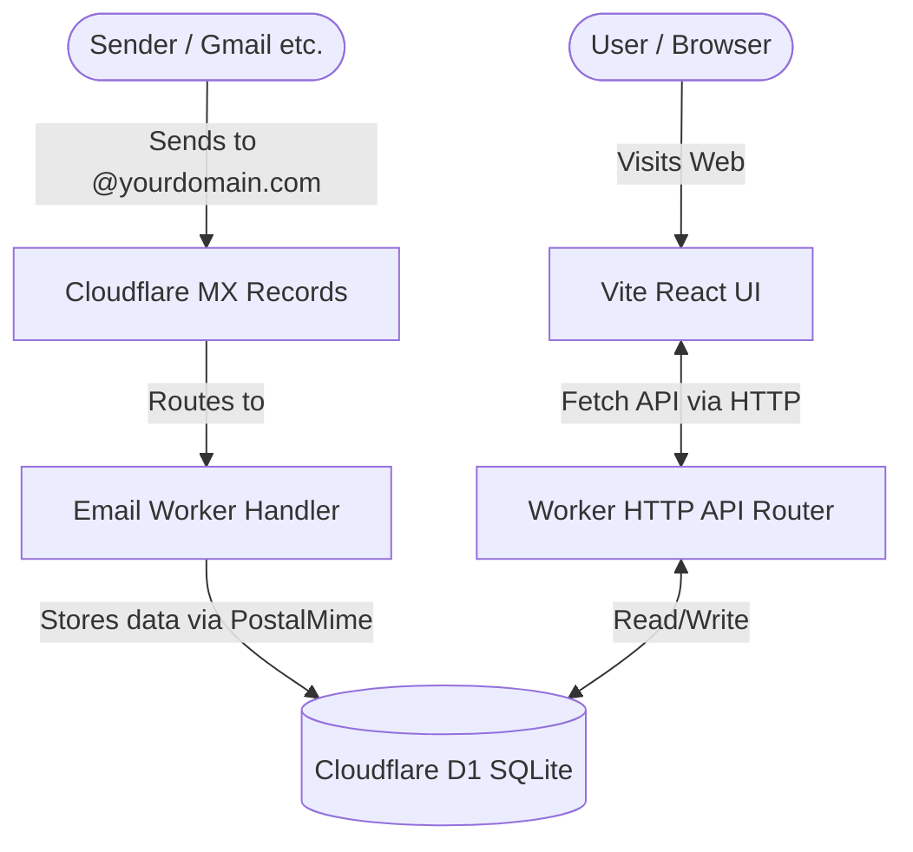

# MailTune

MailTune is a **self-hosted disposable email** service that runs entirely on **Cloudflare Workers** no VPS required. 

This project uses Cloudflare Email Workers to receive inbound emails instantly, D1 Database for storage, and serves a **Premium Neobrutalism** web interface built with React and Vite.

---

## 📌 Architecture & Workflow

The system is designed to be lightweight and run completely on the edge. Here is the workflow diagram:



**Architecture Benefits:**
- **No VPS:** Everything runs on Cloudflare's edge network.
- **No Postfix/SMTP Server:** Cloudflare handles email ingestion natively.
- **Free:** Comfortably fits within Cloudflare's Free Tier limits.

---

## 📁 Project Structure

```text
mailtune/
├── wrangler.toml              # Cloudflare Worker & D1 Configuration
├── package.json               # Root scripts (deploy, db:migrate, etc)
├── API.md                     # REST API Documentation
├── frontend/                  # ⚛️ FRONTEND SOURCE (React + Vite)
│   ├── src/                   # UI Components, Hooks, API Client, CSS
│   ├── package.json           # Frontend dependencies
│   └── vite.config.ts         # Vite settings & API Proxy
└── src/                       # ⚙️ BACKEND SOURCE (Workers)
    ├── index.ts               # Entry point (API Router & Email Handler)
    ├── email-handler.ts       # Inbound email parsing logic
    ├── api/                   # API Endpoints (Hono)
    ├── db/                    # Database Schema & SQL Queries
    └── web/                   # ⚠️ AUTO-GENERATED: Frontend build output
```

---

## 📚 Documentation Guides

Please refer to the specific guides below depending on what you want to do:

1. ⚙️ **[Configuration Guide (`wrangler.toml`)](./CONFIG.md)** — How to properly fill out your environment variables and routes.
2. 🚀 **[Deployment Guide](./DEPLOYMENT.md)** — How to deploy the application directly from your IDE / Terminal.
3. 🔌 **[API Reference](./API.md)** — Documentation for the API endpoints if you want to build your own client.

---

*Original Developer by [lrmn7](https://github.com/lrmn7)*
